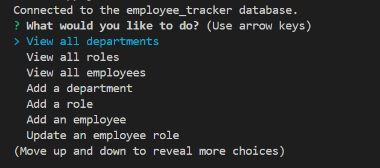
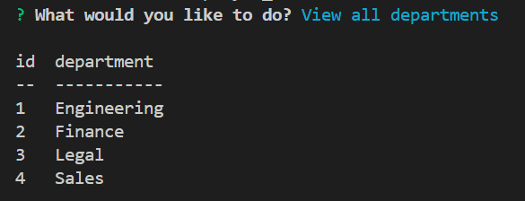
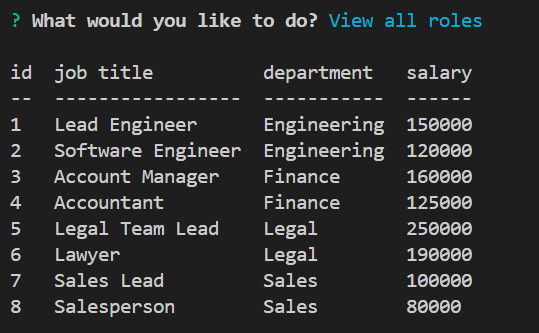
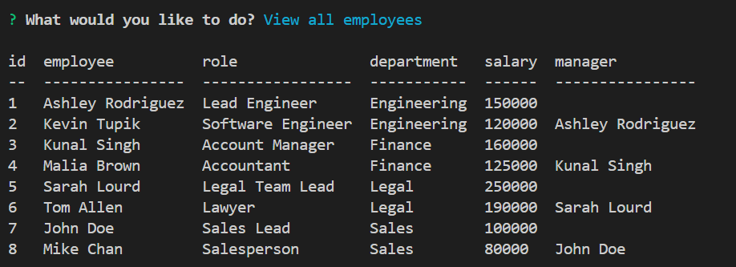
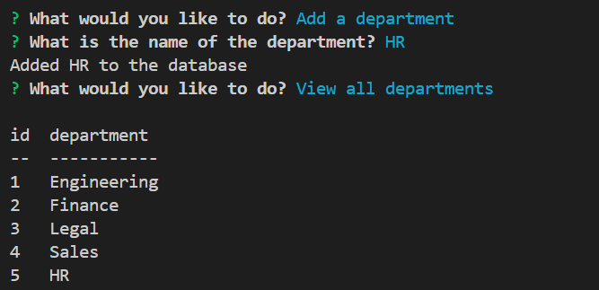
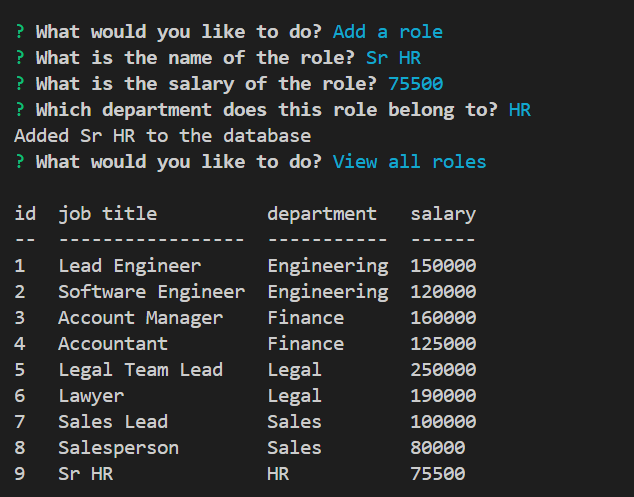
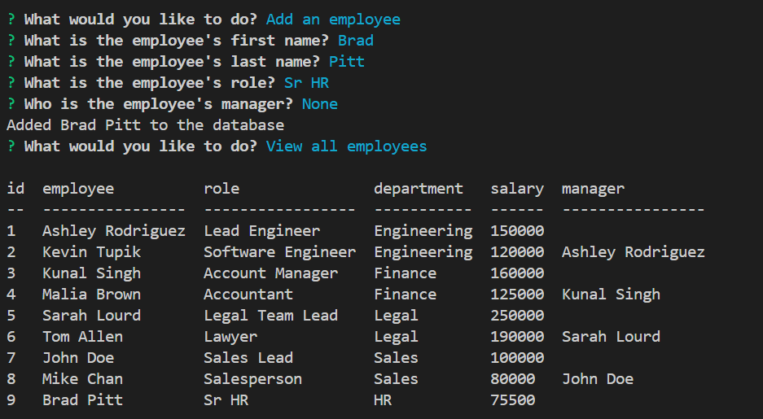
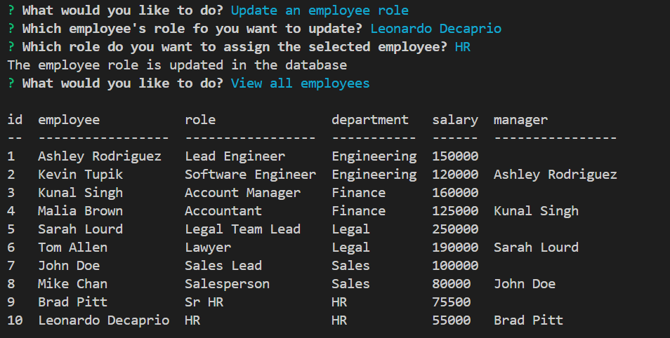

# Employee Tracker

## Description
In this challenge, I built a command-line application to manage a company's employee database, using Node.js, Inquirer to interact with a user via the command line, and PostgreSQL database to store data and perform various queries. Refer to the demonstration video posted in the [Review](#review).

- When starting the application, the user is presented with the following options: view all departments, view all roles, view all employees, add a department, add a role, add an employee, and update an employee role.

    

- When choosing to view all departments, the user is presented with a formatted table showing department names and department ids.

    

- When choosing to view all roles, the user is presented with the job title, role id, the department that role belongs to, and the salary for that role.

    

- When choosing to view all employees, the user is presented with a formatted table showing employee data, including employee ids, first names, last names, job titles, departments, salaries, and managers that the employees report to.

    

- When choosing to add a department, the user is prompted to enter the name of the department and that department is added to the database.

    

- When choosing to add a role, the user is prompted to enter the name, salary, and department for the role and that role is added to the database.

    

- When choosing to add an employee, the user is prompted to enter the employee’s first name, last name, role, and manager and that employee is added to the database.

    

- When choosing to update an employee role, the user is prompted to select an employee to update and their new role and this information is updated in the database.

    

## Table of Contents
* [Installation](#installation)
* [Usage](#usage)
* [Review](#review)
* [Contact](#contact)

## Installation
Clone this project repository to your computer. 
Use the terminal to run the commands - use the command "npm install" to install application dependecies. 

## Usage
Navigate to the project folder in the terminal. 
Invoke the application by typing "node app.js" in the terminal's command line. 

## Review
The walkthrough video that demonstrates application functionality: [video](https://drive.google.com/file/d/1hkolbZtV-snBXK4h45uq6XG7-omolXhu/view)

## Contact
Contact me with any ideas or requests: akravt1274@gmail.com
